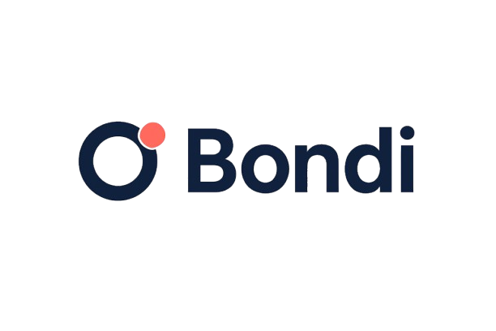

# Bondi: The Protocol for Collective Asset Ownership

<p align="center">
  
</p>

<h1 align="center">Co-own Anything. Together. On-Chain.</h1>

Bondi is a decentralized protocol that empowers groups to co-own high-value assets, pool capital securely, and share revenues with complete transparency. Whether it’s a blue-chip NFT, a high-performance GPU cluster, or tokenized real estate, Bondi makes group investment simple, liquid, and secure.

This repository contains the source code for the Bondi landing page, built with Next.js, TypeScript, and Framer Motion.

---

## ✨ Core Features

- **Secure Asset Vaults (Bonds):** Create non-custodial smart contract vaults to pool funds for a specific asset. Capital is locked and transparently managed until the acquisition target is met.
- **Liquid Fractional Ownership:** Receive ERC-20 tokens representing your exact share of an asset. Your ownership is a liquid, tradable asset itself.
- **Automated Revenue Streams:** Profits generated by assets (e.g., staking rewards, rental income) are automatically distributed to token holders proportional to their stake.
- **On-Chain Governance:** Each Bond acts as a mini-DAO. Key decisions, like when to sell an asset, are made collectively through on-chain voting.
- **Asset Abstraction:** The protocol is designed to be asset-agnostic, supporting a wide range of digital, physical, and financial assets.

---

## 🚀 How It Works

1.  **Define the Bond:** Propose an asset to co-own, setting the funding goal and contribution rules.
2.  **Pool Capital Securely:** Invite members to contribute funds to the Bond's secure, non-custodial vault.
3.  **Acquire & Fractionalize:** Once the goal is met, the protocol automatically acquires the asset and distributes fractional ownership tokens to contributors.
4.  **Earn, Govern, & Exit:** Utilize the asset, receive revenue, vote on proposals, and sell your fractional shares whenever you choose.

---

## 💡 Example Use Cases

- **AI & Dev Teams:** Pooling funds to rent high-end GPU cloud instances for model training.
- **NFT Collectors:** Co-owning blue-chip NFTs and automatically splitting resale profits.
- **Staking Validators:** Aggregating capital (ETH, SOL, etc.) to run validator nodes and streaming rewards daily.
- **Creative Studios:** Sharing expensive software licenses (e.g., Adobe CC, Figma Pro) with token-gated access.
- **Investment Clubs:** Fractionally owning tokenized real-world assets like collector cars, luxury watches, or real estate.

---

## 🛠️ Technology Stack

This landing page is built with a modern, performant, and developer-friendly stack:

- **Framework:** [Next.js](https://nextjs.org/) 14 (App Router)
- **Language:** [TypeScript](https://www.typescriptlang.org/)
- **Styling:** [Tailwind CSS](https://tailwindcss.com/) with [shadcn/ui](https://ui.shadcn.com/) components
- **Animations:** [Framer Motion](https://www.framer.com/motion/)
- **Deployment:** [Vercel](https://vercel.com/)

---

## 🏁 Getting Started

To run the project locally, follow these steps:

1.  **Clone the repository:**
    ```bash
    git clone [https://github.com/your-username/bondi.git](https://github.com/your-username/bondi.git)
    cd bondi
    ```

2.  **Install dependencies:**
    ```bash
    npm install
    # or
    yarn install
    # or
    pnpm install
    ```

3.  **Run the development server:**
    ```bash
    npm run dev
    # or
    yarn dev
    # or
    pnpm dev
    ```

Open [http://localhost:3000](http://localhost:3000) with your browser to see the result. You can start editing the page by modifying `src/app/page.tsx`.

---

## 🤝 Contributing

Contributions are welcome! If you have ideas for improvements or find any issues, please open an issue or submit a pull request.

1.  Fork the Project
2.  Create your Feature Branch (`git checkout -b feature/AmazingFeature`)
3.  Commit your Changes (`git commit -m 'Add some AmazingFeature'`)
4.  Push to the Branch (`git push origin feature/AmazingFeature`)
5.  Open a Pull Request

---

## 📄 License

This project is licensed under the MIT License. See the `LICENSE` file for details.
